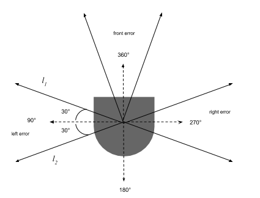

# CompRobo: Warmup Project
##### Anna Griffin, Sherrie Shen
##### September 28, 2020

 

### Introduction
For the first project of the course Computational introduction to Robotics, our goal was to familiarize ourselves with using ROS to control a Neato robot vacuum in a virtual world. We programmed the robot to perform a variety of behaviors in response to both environmental cues or input control. The main topic that we utilized to achieve these behaviors was the \verb|cmd_vel| topic which communicates the robot's velocity. We also heavily relied on the Lidar sensor to give us an idea of the robot's surroundings. 

 

### Teleop
Our teleop node controls the robot from a variety of keyboard commands. We have chosen specific keys to map to different behaviors allowing us to control the robot with keyboard commands. This node has commands that can control both the movement of the robot and the speed. The \verb|cmd_vel| topic, of type Twist, was the only one we needed to publish for this node. This allowed us to modify the both the linear and angular velocities of the robot. While the program is running, it continuously checks to see if a key has been pressed. Upon detection of a valid key command, a new Twist object is created and the corresponding values from the look up dictionary are assigned. Movement bindings modify the x,y,z, and theta values while the speed bindings just take into account the linear and angular velocities. Once the new Twist has been initialized accordingly, we publish it in order for the robot to handle the change.

Figure 1: Key binding mappings for direction and speed

 

### Driving in a Square
This node moves the robot in a 1m by 1m square using velocity and timing. The robot drives straight and then turns 90 degrees and continues until it has completed all four sides. Again, just the `cmd_vel` topic is being published since only the velocity needs to known and changed. We can set the distance it moves forward by using the equation *distance = velocity x time*. We know that we can change the velocity by publishing a new Twist object and use rospy timer package to control how much time elapses. When we want the robot to move in a straight line, we set the linear velocity to 1 for 1 second. Then we change just the angular velocity to 1 to initiate the turn. The Neato measures the angles in radians so we have it turn for *pi/2* seconds since the velocity is 1 radian per second and we want it to turn 90 degrees. Therefore, we only need to repeat the execution of two different steps. 

While the math that we did checks out for this behavior, it is not perfect since there is no way to determine whether or not the robot performed accurately. There is no feedback and factors like the surface on which it is running could potentially alter the precision of the calculations. We also could have used a loop in our `run()` function to make it look a little bit neater. 

 

### Wall Following
This node makes the Neato to find a wall and align its orientation so that it eventually is parallel to it. This time, in addition to publishing to the `cmd_vel` topic, we also want to be able to detect where the walls are so we subscribe to the Neato's lidar readings from the `scan` topic. The message type for the `scan` topic is a LaserScan which, among other things, provides an array of ints with readings for every angle. In order to measure the position of the robot relative to the nearest wall we established four different pairs of angles to define the front, back, left, and right error values. 

Figure 2

After setting these boundaries, we can use the distance readings from the lidar sensor to determine at which angle the wall is to the robot at any given moment. Ideally, when the robot is parallel to the wall, the readings from the two angles surrounding 90 and 270 will be the same due to the rules of geometry. This is illustrated in the image below. 
 

    |  
:-------------------------:|:-------------------------:
Figure 3: |  Figure 4:
 

In Figure 3 where the robot is not parallel to the wall, angles A and B are not equal. On the other hand, when A and B are equal, as shown in Figure 4, we know that the robot is parallel to the wall. This orientation forms an isosceles triangle in between the robot and the wall and by the definition of isosceles triangles, the two sides that aren't between the two equal angles are also equal. From the scanner, we get readings of distances and can use these to calculate the angle at which the wall is relative to the Neato. 

### Person Following
This person following node leverages center of mass calculations to determine where the largest object is in the Neato's field of view and proportional control to adjust accordingly. To gather the laser data from the area in front of the robot, we subscribed to the `scan` topic and published to the `cmd_vel` topic to make the updates once locating the center of mass. The field included 90 degrees to the left and to the right of the center of the neato. To find the center of mass, we calculated the x and y distances from the center point of the robot on the cartesian plane. Using trigonometry identities, the *x* values evaluate to *opposite/hypotenuse* and the *y* values can be found by *adjacent/hypotenuse*. The average of both of these gives us the x,y coordinate of the center of mass. Ultimately we need to know the angle that the robot needs to turn to continue following the object but we just have x and y coordinates. Therefore, we need to find the angle at which the center of mass point lies. Using the tangent identity *opposite/adjacent*, we can get the angle the center of mass point makes with the robot's center line (degree 0).

Figure 5:
 

Before we can tell it to turn, we added a check to see how far away the calculated center of mass is so that it doesn't collide with the object. If it farther than the threshold, then we publish the new angular velocity to the \verb|cmd_vel| topic. 
### Obstacle Avoidance

 

### Combining Behaviors and Finite-State Control

 

### Improvement and Takeaways
For the first project of the semester, we think that it went reasonably well. Both of us had a little bit of experience with ROS from working in Paul's Lab over the summer after our freshmen year; however it had been quite some time so this was a nice entry back into it. One thing that we learned from this experience is that talking, drawing, and writing out a plan of action before jumping into code yielded the best outcome. It can be tempting to want to start doing hands on work right away but we found that it was helpful for both of us to discuss the problem and think about it conceptually. This gave us a better starting point when we did approach the code and a better overall understanding of the objective.

We both have limited knowledge about and experience working with robots which creates a bit of a bigger learning curve. We both have backgrounds in software development and have discovered the debugging experience is quite different from what we are used to. Because of the nature of working with a physical object and having the responsibility of dictating its behavior there isn't really a clear line between working and not working. The are unlimited number of situations that the robot can be in and 