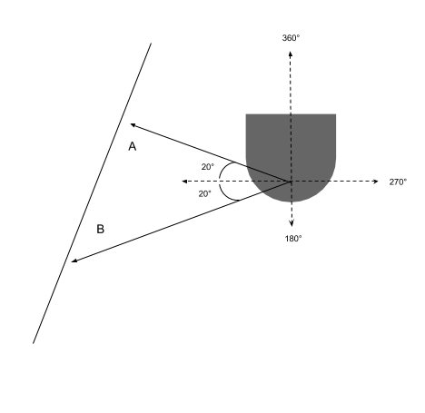
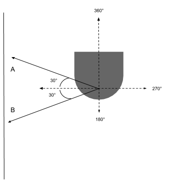
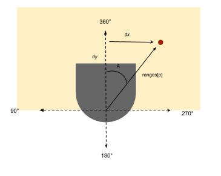
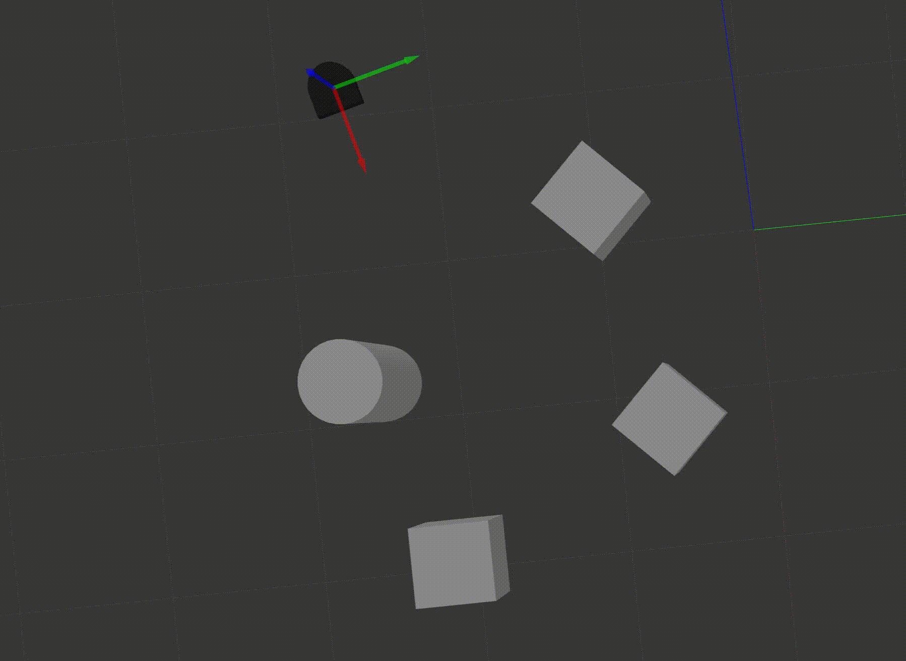

# CompRobo: Warmup Project
 Anna Griffin, Sherrie Shen 
 September 28, 2020

 

## Introduction
For the first project of the course, Computational introduction to Robotics, our goal was to familiarize ourselves with using ROS to control a Neato robot vacuum in a virtual world. We programmed the robot to perform a variety of behaviors in response to both environmental cues or input control. The main topic that we utilized to achieve these behaviors was the `cmd_vel` topic which communicates the robot's velocity. We also heavily relied on the Lidar sensor to give us an idea of the robot's surroundings. 

 

## Keyboard Teleop
Our teleop node controls the robot from a variety of keyboard commands. We have chosen specific keys to map to different behaviors allowing us to control the robot. This node has commands that can control both the movement of the robot and the speed. The `cmd_vel` topic, of type Twist, was the only one we needed to publish for this node. Publishing to this topic allowed us to modify both the linear and angular velocities of the robot. While the program is running, it continuously checks to see if a key has been pressed. Upon detection of a valid key command, a new Twist object is created and the corresponding values from the look up dictionary are assigned. Movement bindings modify the x,y,z, and theta values while the speed bindings just take into account the linear and angular velocities. Once the new Twist has been initialized accordingly, we publish it in order for the robot to handle the change.

Figure 1: Key binding mappings for direction and speed

 

## Driving in a Square
This node moves the robot in a 1m by 1m square using velocity and timing. The robot drives straight and then turns 90 degrees and continues until it has completed all four sides. Again, just the `cmd_vel` topic is being published since only the velocity needs to be known and changed. We can set the distance it moves forward by using the equation *distance = velocity x time*. We know that we can change the velocity by publishing a new Twist object and can use the rospy timer package to control how much time elapses. When we want the robot to move in a straight line, we set the linear velocity to 1 for 1 second. Then we change just the angular velocity to 1 to initiate the turn. The Neato measures the angles in radians so we have it turn for *pi/2* seconds (the velocity is 1 radian per second and we want it to turn 90 degrees). Therefore, we only need to repeat the execution of two different steps to complete the whole square. 

While the math that we did checks out for this behavior, it is not perfect since there is no way to determine whether or not the robot performed accurately. There is no feedback and factors like the surface on which it is running could potentially alter the precision of the calculations. We also could have used a loop in our `run()` function to make it look a little bit neater. 

*Small delay at the beginning of recording

 

## Wall Following
This node makes the Neato find a wall and align its orientation so that it eventually is parallel to it. This time, in addition to publishing to the `cmd_vel` topic, we also want to be able to detect where the walls are so we subscribe to the Neato's lidar readings from the `scan` topic. The message type for the `scan` topic is a LaserScan which, among other things, provides an array of ints with readings for every angle. In order to measure the position of the robot relative to the nearest wall we established three different pairs of angles to define the front, left, and right error values. 

Figure 2: Front, left, and right error bounds

After setting these boundaries, we use the distance readings from the lidar sensor to determine the angle at which the wall is to the robot at any given moment. Ideally, when the robot is parallel to the wall, the readings from the two angles surrounding 90 or 270 will be the same due to the rules of geometry. This is illustrated in the image below. 
 

    |  
:-------------------------:|:-------------------------:
Figure 3: Not parallel to the wall: \|A\| != \|B\|.  | Figure 4: Parallel to the wall: \|A\| = \|B\|.
 

In Figure 3 where the robot is not parallel to the wall, angles A and B are not equal. On the other hand, when A and B are equal, as shown in Figure 4, we know that the robot is parallel to the wall. This orientation forms an isosceles triangle in between the robot and the wall and by the definition of isosceles triangles, the two sides that aren't between the two equal angles are also equal. From the scanner, we get readings of distances and can use their differences to gauge the Neato's position relative to the wall and use a proportional controller to make adjustments to make it parallel if it isn't already.

This implementation required a lot of fine tuning. The front, right, and left boundary ranges had an immense effect on the performance of the Neato. When the area was too large, there was too much noise making it difficult for it to distinguish the wall. We also started with taking into account an error boundary in the back, however this hindered its ability to trail the wall more than it helped we discovered. The k values were also very particular and affected how sensitive it was to the wall readings and the rate at which it adjusted. There was a lot of improvement from our first implementation, mostly due to tweaking these parameters and watching the robot's behavior. 

*Small delay at the beginning of recording

 

## Person Following
This person following node leverages center of mass calculations to determine where the largest object is in the Neato's field of view and proportional control to adjust accordingly. To gather the laser data from the area in front of the robot, we subscribed to the `scan` topic and published to the `cmd_vel` topic to make the updates once we located the center of mass. The field included 90 degrees to the left and to the right of the center of the Neato. To find the center of mass, we calculated the x and y distances from the center point of the robot in the cartesian plane. Using trigonometry identities, the *x* values are evaluated with *opposite/hypotenuse* and the *y* values can be found by *adjacent/hypotenuse*. The average of both of these sets gives us the x,y coordinate of the center of mass. Ultimately we need to know the angle that the robot needs to turn to continue following the object but we just have x and y coordinates. Therefore, we need to find the angle at which the center of mass point lies. Using the tangent identity *opposite/adjacent*, we can get the angle the center of mass point makes with the robot's center line (degree 0).

Figure 5: Geometry for one point
 

Before we can tell it to turn, we added a check to see how far away the calculated center of mass is so that it doesn't collide with the object. If it farther than the threshold, then we publish the new angular velocity to the `cmd_vel` topic. 

 

## Obstacle Avoidance

The goal of this challenge of the Neato is to move forward while avoiding obstacles along the way. We achieved this by applying a potential field to the goal or direction of desire and all the obstacles detected through Neato's laser scan as shown in Figure 6. We apply an attractive potential to the goal because it will attract the robot towards the goal's direction. Similarly, we apply a repulsive force to each of the obstacles detected. 

Figure 6: Potential field generated by applying a repulsive force to each of the obstacles and an attractive force to the preferred direction of motion. Image borrowed from CompRobo Warmup project description page.
 

The steps to compute all the potential vectors and translate them to an action for the robot to execute are listed as follows:

1. Compute repulsive potential for each obstacle detected:
    * delta_X_obstacle = -b\*(s-d)\*cos(\Theta)
    * delta_Y_obstacle = -b\*(s-d)\*sin(\Theta)

    where 
    * b is a parameter scaling the strength of this repulsive field
    * s is a parameter scaling the radius of circle of influence from the edge of the obstacle
    * d is the distance between the obstacle and the Neato
    * \Theta is the angle where the obstacle is detected by the laser scan of the Neato
2. Compute attractive potential for the goal or direction of desire:
    * delta_X_goal = a\*d\*cos(\Theta)
    * delta_Y_goal = a\*d\*sin(\Theta)

where
    * a is a parameter scaling the strength of this attractive field
    * s is a parameter scaling the radius of circle of influence from the edge of the goal
    * d is the distance between the goal and the Neato. For this implementation, d = 1.5 which means there is always an imaginary goal that is 1.5 m away from the Neato.
    * \Theta is the angle between the zero degree vector pointed from the front of the Neato and the vector pointing from the Neato to the goal. For this implementation, \Theta equals to 0 as we want the Neato to keep moving forward so the imaginary goal is always placed at the front of the Neato.

3. Sum all the potential fields
    * delta_X_total = delta_X_obstacles + delta_X_goal
    * delta_Y_total = delta_Y_obstacles + delta_Y_goal

4. Compute Neato linear and angular velocity:
    * v = square_root(delta_X_total^2 + delta_Y_total^2)
    * w = arctan(delta_Y_total/delta_X_total)

### Performance and Moving Beyond

The object avoidance behavior is pretty robust after we calibrated the scaling factors (a,b,s) and implemented proportional control for steering the Neato towards this desired angle while still maintaining forward velocity. For s, we have to be careful not to give it too large of a value such that when the obstacles are close to each other, their circle of influence heavily overlap each other and forces the Neato to endless spinning in circles. To improve our algorithm and moving beyond, we could include an actual goal of known position in the global frame and calculate the distance and angle of the goal relative to the Neato frame using coordinate transform and the Neato's odometry. In that case, we also need to be able to tell apart the obstacles and the goal from the laser scan using circle detection and line detection.

 

## Combining Behaviors and Finite-State Control

We decided to give the Neato two different states, person following and wall following, for this node. The Neato starts with following a wall in its right angle of view. As the robot follows the wall, when there is an object detected between the robot's view of 0 to 90 degrees, it recognizes it as a person and starts following the person and stops in front of the person within a target distance. When we remove the person from the robot's view angle for person follower, the robot looks to see if there is a wall near by on its right and if so, it gravitates towards it and starts following it. These two states are independent and are triggered by the existence of a "person" in the field of view. To illustrate these conditions, we made a simple finite state diagram. 

### Performance and Moving Beyond
The finite state control of the two behaviors work relatively well after recalibrating the parameters we have for each individual task. There is one challenge we faced when integrating the two behaviors together. When the robot is slightly facing towards the wall, it can mistaken the wall as a person as there is no way for the Neato to differentiate between the wall and the person from the laser scan. How we resolved this issue is we count the number of non infinite laser scans in the view angle pair (0,90) for person following. If the number of non infinite scans is greater than certain threshold, we trigger the person following state. A better way to approach this would be implementing circle detection for the person Neato is following so the robot can tell apart the wall and the person.

 

## Takeaways
For the first project of the semester, we think that it went reasonably well. Both of us had a little bit of experience with ROS from working in Paul's Lab over the summer after our freshmen year; however it had been quite some time so this was a nice entry back into it. One thing that we learned from this experience is that talking, drawing, and writing out a plan of action before jumping into code yielded the best outcome and how to adjust the parameters like k for proportional control based on the behavior of the robot. It can be tempting to want to start doing hands on work right away but we found that it was helpful for both of us to discuss the problem and think about it conceptually. This gave us a better starting point when we did approach the code and a better overall understanding of the objective.

We both have limited knowledge about and experience working with robots which creates a bit of a bigger learning curve. Since we both have backgrounds in software development. we have discovered the debugging experience is quite different from what we are used to. Because of the nature of working with a physical object and having the responsibility of dictating its behavior there isn't really a clear line between working and not working. The are unlimited number of scenarios to account for which makes the idea of completion more ambiguous. 

We could improve our project by making our robot more robust and check edge cases that we might have left out. Additionally, we could try adding another behavior to our finite state controller adding another layer of complexity to it. Since these exercises were a challenge for us, learned a lot, however, now that we have the nodes written that fulfill the behavioral requirements, we could explore some of the going beyond challenges.
